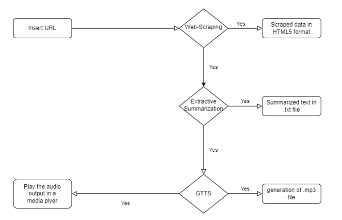
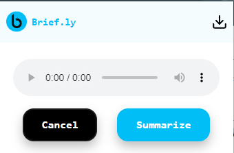
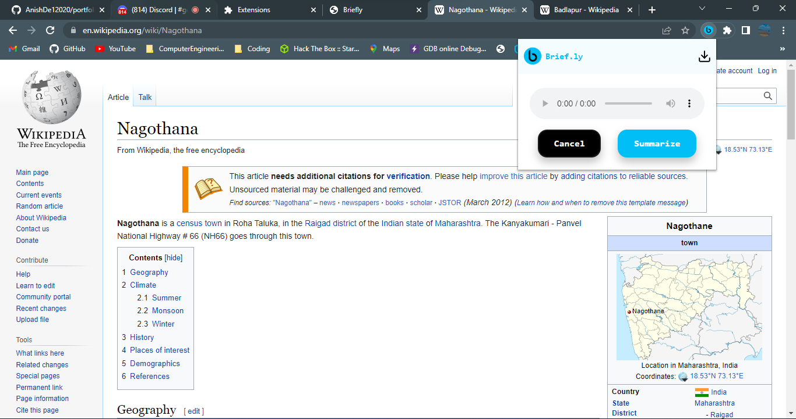

# briefly - Summarization of Web Articles and Audio Output Generation

Brief.ly is a Web Application that aims to retrieve a certain article, news or any textual information from the provided URL of the website and convert the same to a perfect short version summary which would be finally turned into an audio format that could be easily listened to. We intend to implement web-scraping, extractive summarization and text-to-speech conversion to give the desired output. Our main motive with this project is to spend mundane time wisely by listening to something productive for instance while traveling. 

[Briefly Report](https://docs.google.com/document/d/1E4_56Jobla8tImKAiX_jhx73VACyISTRtKxTuRLK0j0/edit?usp=sharing)

# Requirements
- node v16+
- python v3+
- pytorch v1.13.0 

# Setup

[extension](./extension/README.MD)

[server](./server/README.md)

# Working

- We would First group textual data together from the article. This is called Web-content mining or web-scraping.
- Individually words are separated and tokenized. 
- Each word’s frequency is calculated. The frequency of the word which is highest is chosen and every word frequency is divided with that frequency. 
- The values generated are between 0 and 1. 
- The values closer to 1 are selected and sentences which contain them are prioritized. 
- The sentences with most priority are selected and a summary is successfully extracted

# Result 

Extension UI

Extension on webpages